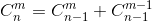
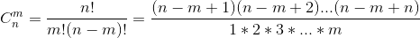

# algorithm-note

- 推荐使用 **code::blocks**, **C-Free**, **dev-c++**
- 目录结构 `评测系统名/题号`

### 算法归纳

#### 排序

- 选择排序
- 插入排序
- 排序题与sort函数的应用

#### 散列

- 整数散列
- 字符串hash（ASCII码表示）

#### 递归

- 全排列

```c++
#include <cstdio>
const int maxn = 11;
int n,P[maxn],hashTable[maxn] = {false};

void generateP(int index){
    if(index == n+1){
        for(int i = 1;i <= n;i++){
            printf("%d", P[i]);
        }
        printf("\n");
        return;
    }
    for(int x = 1;x <= n;x++){
        if(hashTable[x] == false){
            P[index] = x;
            hashTable[x] = true;
            generateP(index+1);
            hashTable[x] = false;
        }
    }
}

int main(){
    n = 3; // 1~3的全排列
    generateP(1);
    return 0;
}
```

- n皇后问题

#### 贪心

- 简单贪心
- 区间贪心

#### 二分

- 二分查找
- 二分法拓展
  - `f(x)=x²`计算根号2的值
  - 半圆形储水装置的装水问题
  - 木棒切割问题（段数一定的情况下每段最长多长）
- 快速/二分幂

```c++
// 计算a^b % m
typedef long long LL;

// 递归写法
LL binaryPow(LL a, LL b, LL m){
  if(b == 0) return 1;
  if(b % 2 == 1) return a*binaryPow(a, b-1, m) % m;
  else{
    LL mul = binaryPow(a, b / 2, m);
    return mul * mul % m;
  }
}

// 迭代写法
LL binaryPow(LL a, LL b, LL m){
  LL ans = 1;
  while(b > 0){
    if(b & 1){
      ans = ans * a % m;
    }
    a = a * a % m;
    b >>= 1;
  }
}
```

#### two pointers

体会一下下面这段代码，寻找`a[i]+a[j]=M`的组合。

```c++
// a[x]有序
while(i < j){
    if(a[i] + a[j] == M){
        cout << i,j << endl;
      	i++;
      	j--;
    }else if(a[i] + a[j] < M){
        i++;
    }else{
        j--;
    }
}
```

- 2-路归并排序


```c++
// recursive
void mergeSort(int a[], int left, int right){
    if(left < right){
        int mid = (left+right)/2;
      	mergeSort(a, left, mid);
      	mergeSort(a, mid+1, right);
      	merge(a, left, mid, mid+1, right);// 合并[left,mid],[mid+1,right]
    }
}

// 非递归
void mergeSort(int a[]){
    for(int step = 2;step /2 <= n;step *= 2){
        for(int i = 1;i <= n;i += step){
            int mid = i + step / 2 - 1;
          	if(mid + 1 <= n){
                merge(a, i, mid, mid+1, min(i+step-1,n));
            }
        }
    }
}
```

- 快速排序

```c++
void quickSort(int a[], int left, int right){
    if(left < right){
        int pos = partition(a, left, right);
      	quickSort(a, left, pos);
      	quickSort(a, pos+1, right);
    }
}

int partition(int a[], int left, int right){
  	int temp = a[left];
    while(left < right){
        while(left < right && a[right] > temp) right--;
      	a[left] = a[right];
      	while(left < right && a[left] <= temp) left++;
      	a[right] = a[left];
    }
  	a[left] = temp;
  	return left;
}
```

### 数学问题

#### 数字黑洞

主要是`to_array`、`to_number`函数的编写

#### 最大公约数和最小公倍数

```c++
// 最大公约数gcd
int gcd(int a, int b){
    if(b == 0) return a;
  	else return gcd(b, a%b);
}

// 最小公倍数
int lcm(int a, int b){
    return a / gcd(a,b) * b; // 防止a*b溢出，所以写成a/gcd*b
}
```

#### 素数

```c++
// 1不是素数
bool isPrime(int a){
  	if(a <= 1) return false;
  	int sqr = (int)sqrt(1.0*a);
    for(int i = 2;i <= sqr;i++){
        if(a % i == 0) return false;
    }
  return true;
}
```

- 埃氏筛法-寻找素数表

```c++
// 时间复杂度O(nloglogn)
const int maxn = 101; // 表长
int prime[maxn], pNum = 0;
bool p[maxn] = {0};
void Find_Prime(){
    for(int i = 2;i < maxn;i++){
        if(p[i] == false){
          	prime[pNum++] = i;
            for(int j = i + i;j < maxn;j += i){
                p[j] = true;
            }
        }
    }
}
```

#### 质因子分解

```c++
struct factor{
    int x, cnt; // x为质因子，cnt为其个数
}fac[10];

if(n % prime[i] == 0){
    fac[num].x = prime[i];
  	fac[num].cnt = 0;
  	while(n % prime[i] == 0){
        fac[num].cnt++;
      	n /= prime[i];
    }
  	num++;
}

if(n != 1){
    fac[num].x = n;
  	fac[num++].cnt = 1;
}
```

#### 大整数运算

```c++
// big number结构体表示
struct bign{
    int d[1000];
  	int len;
  	bign(){ // 结构体的构造函数
        memset(d,0,sizeof(d));
      	len = 0;
    }
}
```

- 高精度（大整数）加减法

#### 组合数

- n!中有多少个质因子p

```c++
// (n/p + n / p^2 + n / p^3 + ···)
int cal(int n, int p){
    int ans = 0;
  	while(n){
        ans += n / p;
      	n /= p;
    }
  	return ans;
}
```

- 组合数的计算

直接按定义算容易超出数据范围，即使是`long long`类型也只能接受`n<=20`的运算，不做阐述。所以利用下面这个公式可以写出递归函数。



```c++
// 递归
long long res[67][67] = {0};
long long C(long long n, long long m){
    if(m == 0 || m == n) return 1;
  	if(res[n][m] != 0) return res[n][m]; // 避免重复计算
  	return res[n][m] = C(n-1,m) + C(n-1,m-1);
}

// 递推
const int n = 60;
void calC(){
    for(int i = 1;i <= n;i++){
        res[i][0] = res[i][i] = 1;
    }
  	for(int i = 2;i <= n;i++){
        for(int j = 0;j <= i/2;j++){
            res[i][j] = res[i-1][j] + res[i-1][j-1];
          	res[i][i-j] = res[i][j];
        }
    }
}
```

或者另法



```c++
// O(m)时间复杂度，excellent
long long C(long long n, long long m){
    long long ans = 1;
  	for(long long i = 1;i <= m; i++){
        ans = ans * (n-m+i) / i; // 一定要先乘再除，保证整除
    }
  	return ans;
}
```

### C++标准模板库STL

**注意：涉及到的区间问题通通都是左闭右开**

- vector `vector<typename> a;`


- set `set<typename> a;`
- string `string str;`
- map `map<typename1, typename2> mmp;`
- queue `queue<typename> name;`
- priority_queue `priority_queue<typename> name;` 重载
- stack `stack<typename> name;`
- pair `#include<utility> 可以看作是内部有两个元素的结构体 pair<typename1,typename2> name;`
- algorithm头文件下的常用函数
  - max,min,abs(abs参数必须是整数，浮点数用math头文件下的fabs)
  - swap(x,y)
  - reverse
  - next_permutation(给出一个序列在全排列中的下一个序列)
  - fill
  - sort
  - lower_bound,upper_bound(用在有序数组或容器中)

### 搜索

#### 深度优先搜索DFS

```c++
#include <cstdio>
const int maxn = 30;
int n,V,maxValue = 0; // 物品件数n，背包容量V，最大价值maxValue
int w[maxn],c[maxn]; // 重量，价值
// 时间复杂度O(2^n)，不好
void DFS(int index, int sumW, int sumC){
    if(index == n){
        if(sumW <= V && sumC > maxValue){
            maxValue = sumC;
        }
      	return;
    }
  	DFS(index+1,sumW,sumC);// 不选第index件物品
  	DFS(index+1,sumW+w[index],sumC+c[index]);
}
// 优化，剪枝
void DFS(int index, int sumW, int sumC){
    if(index == n) return;
  	DFS(index+1,sumW,sumC);
  	if(sumW + w[index] <= V){
        if(sumC + c[index] > maxValue){
            maxValue = sumC + c[index];
        }
      	DFS(index+1,sumW+w[index],sumC+c[index]);
    }
}
```

#### 广度优先搜索BFS

```c++
void BFS(int s){
    queue<int> q;
  	q.push(s);
  	while(!q.empty()){
        // 取出队首元素top
      	// 访问队首元素top
      	// 将队首元素出队
      	// 将top的下一层节点中未曾入队的节点全部入队，并设置为已入队
    }
}
```

